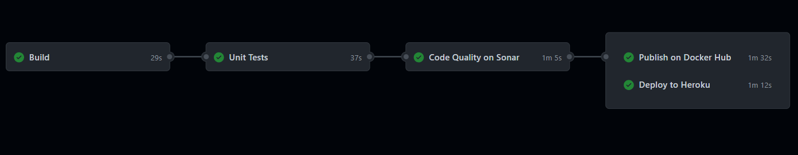

# Reactive Voting Session API

## 🙋‍♂️🙋‍♀️🙋💁💁‍♂️💁‍♀️

### 🧙 API para Sessão de Votação

Esse código é a minha implementação utilizando programação Reativa de um desafio técnico para uma oportunidade como
Desenvolvedor Back-End Java.

 

### ✍️ O Desafio

No cooperativismo, cada associado possui um voto e as decisões são tomadas em assembleias, por votação. A partir disso,
você precisa criar uma solução back-end para gerenciar essas sessões de votação.

#### 📝 Requisitos

Essa solução deve ser executada na nuvem e promover as seguintes funcionalidades através de uma API REST:

✅ 1. Cadastrar uma nova pauta;
 
✅ 2. Abrir uma sessão de votação em uma pauta (a sessão de votação deve ficar aberta por um tempo determinado na chamada
de abertura ou 1 minutos por default);
 
✅ 3. Receber votos dos associados em pautas (os votos são apenas 'Sim'/'Não'. Cada associado é identificado por um id
único e pode votar apenas uma vez por pauta);
 
✅ 4. Contabilizar os votos e dar o resultado da votação na pauta.

 

### 🌐 Acesse a API

#### 📚🔗 Documentação

#### 💙🔗 Para acessar o Health Check:

#### 🚢🔗 Para acessar o relatório do Sonarcloud:

 

### 🟦🔸🟡 DevOps 🟢🔸🔶

#### ✅ Pipeline com Github Actions

Sou um grande fã de CI/CD. Por isso, adicionei nesse projeto uma pipeline, utilizando o GitHub Actions, para executar
ações automatizadas que facilitam a minha vida.

#### #️⃣ A pipeline é constituída das seguintes etapas:

1️⃣ Build: onde é executado o build da aplicação, para validar que ela gera o executável com sucesso;

2️⃣ Unit Tests: onde são executados os testes unitários da aplicação;

3️⃣ Code Quality on Sonar: onde o Sonarcloud faz a análise da qualidade e cobertura do código;

4️⃣ Publish on Docker Hub: nessa etapa cria o container da aplicação e então publica ela no Docker Hub;

5️⃣ Deploy to Heroku: nessa etapa acontece o deploy da aplicação no Heroku;
